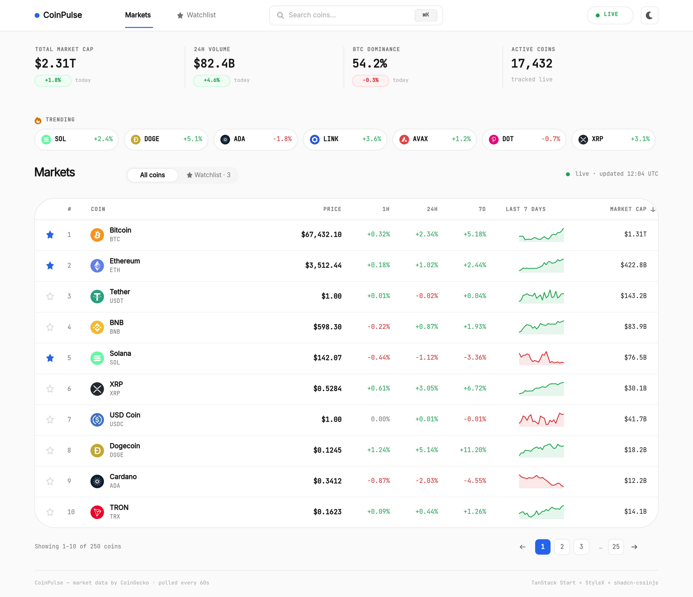
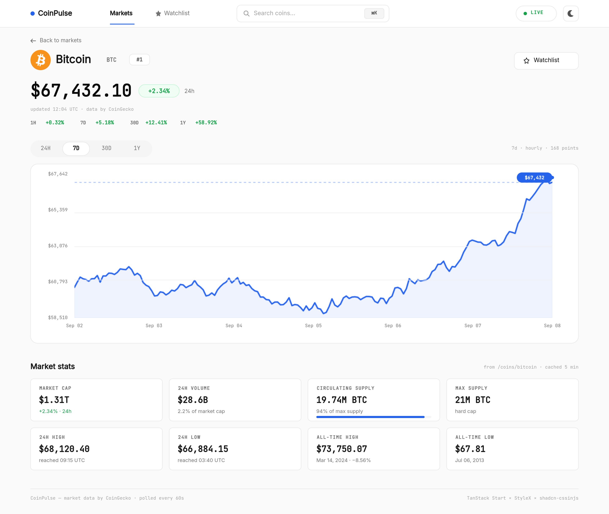

# CoinPulse

**A live crypto market tracker, and a working proof of StyleX + TanStack Start
in production.** Dense, honest data — no invented numbers, no account
required.


> **Note on the images below:** this environment has no browser available to
> capture live screenshots, so these are the design references the UI was
> built to match pixel-for-pixel (see [design/](design)). Swap in real
> screenshots once you've run it yourself — `npm run dev` and it should look
> like this.

## Preview

### Markets dashboard (`/`)



Global stats, a trending rail, and a sortable, paginated, live-polling table
with per-row sparklines and a watchlist.

### Coin detail (`/coin/$coinId`)



Range-tabbed price chart (Recharts), period changes, and a market-stats
grid — every figure traced back to a real CoinGecko field, never invented to
fill a layout.

## Features

- **Markets table** — 250 coins, sortable on every column via shareable URL
  params, tabular numerals, hand-drawn sparklines, green/red price-flash on
  live updates.
- **Coin detail pages** — range-tabbed chart with a crosshair tooltip, ATH/ATL,
  supply, and volume stats.
- **Watchlist** — star any coin, persisted in `localStorage`. No account, no
  server-side sync — and the UI says so honestly.
- **Search** — debounced, keyboard-navigable, grounded entirely in real
  `/search` results.
- **Light + dark themes** — instant toggle, no flash on load.
- **Honest about staleness** — if the data-layer cache falls back to a stale
  value, the UI says so with a timestamp instead of pretending it's live.
- **Rate-limit aware** — server-side caching absorbs repeat requests so the
  free CoinGecko tier survives multiple open tabs; see
  [tasks/11-launch-checks.md](tasks/11-launch-checks.md) for the actual
  numbers and the one real risk found there.

## Tech stack

| | |
|---|---|
| Framework | [TanStack Start](https://tanstack.com/start) (React 19, Vite, SSR) |
| Routing | TanStack Router — file-based, typed search params |
| Data fetching | TanStack Query — polling, stale-while-revalidate |
| Styling | [StyleX](https://stylexjs.com) — the *only* styling system, no exceptions |
| Charts | Recharts (coin-detail chart only — table sparklines are hand-drawn SVG) |
| Validation | Zod, at every server boundary |
| Icons | Lucide |
| Data source | [CoinGecko](https://www.coingecko.com/en/api) free/Demo API |

## Getting started

```bash
npm install
cp .env.example .env   # optional: add COINGECKO_API_KEY to raise rate limits
npm run dev
```

Works with zero configuration — the API key is optional and only raises
CoinGecko's rate limits when present.

## Scripts

| Command | What it does |
|---|---|
| `npm run dev` | Start the dev server on `:3000` |
| `npm run build` | Production build |
| `npm run preview` | Preview the production build |
| `npm run lint` | ESLint, including `@stylexjs/eslint-plugin` |
| `npm run typecheck` | `tsc --noEmit` |
| `npm run generate-routes` | Regenerate the TanStack Router route tree |

## Architecture

```
Browser  →  TanStack Start server functions  →  CoinGecko
   ↑              (Zod validation,
   |               in-memory cache,
   |               429 backoff)
   └── never calls CoinGecko directly, never sees the API key
```

- **The browser never talks to CoinGecko.** Every request goes through a
  `createServerFn` in [src/lib/server/](src/lib/server/), which owns the
  base URL, the optional demo-key header, Zod validation, in-memory caching,
  and exponential backoff on 429s. The API key never ships in the client
  bundle — verified by grepping the build output, not just assumed.
- **One token file, one policy file.** All colors/spacing/type/radii live in
  [src/styles/tokens.stylex.ts](src/styles/tokens.stylex.ts); every cache TTL
  and poll interval lives in [src/lib/data-policy.ts](src/lib/data-policy.ts).
  Nothing is hardcoded per-component.
- **Numbers are never invented.** Where the reference design shows a figure
  CoinGecko doesn't actually provide (e.g. a 24h delta for trading volume),
  the app either omits it or computes a real, honestly-labeled substitute
  (e.g. "since load" instead of a fake "today") — see
  [tasks/03-global-stats-strip.md](tasks/03-global-stats-strip.md).

## Project structure

```
src/
├── routes/              # file-based routes (/, /coin/$coinId)
├── components/          # hand-built StyleX components
├── hooks/               # useWatchlist, usePriceFlash, useSinceLoadDelta, ...
├── lib/
│   ├── server/          # createServerFn wrappers — the only code that talks to CoinGecko
│   ├── data-policy.ts   # every cache TTL / poll interval, in one place
│   └── types.ts         # Zod schemas + inferred types
├── styles/
│   ├── tokens.stylex.ts # design tokens
│   └── themes.stylex.ts # light/dark createTheme
└── theme/               # theme context + localStorage-synced toggle
design/                  # the reference images this UI was built to match
prompts/                 # the approved implementation plan for every phase
tasks/                   # phase-by-phase build status (start here for history)
```

## Project status

Every phase in the original roadmap is built — see
[tasks/README.md](tasks/README.md) for the full status table, and
[prompts/](prompts) for the approved plan behind each one (this repo follows
a plan-then-build workflow; see [agents.md](agents.md) for the full rules).
The one open item worth knowing about before deploying anywhere real:
[tasks/11-launch-checks.md](tasks/11-launch-checks.md) documents a genuine
CoinGecko quota risk under sustained use.
